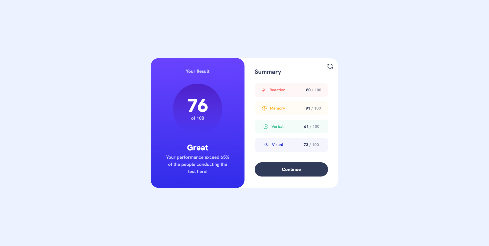
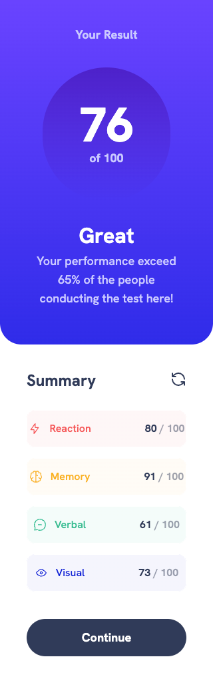

# Frontend Mentor - GitHub user search app solution

This is a solution to the [Results summary component challenge on Frontend Mentor](https://www.frontendmentor.io/challenges/results-summary-component-CE_K6s0maV).

## Table of contents

- [The challenge](#the-challenge)
- [Screenshot](#screenshot)
- [Links](#links)
- [Built with](#built-with)
- [Author](#author)

## The challenge

Users should be able to:

- View the optimal layout for the interface depending on their device's screen size
- See hover and focus states for all interactive elements on the page
- Bonus: Use the local JSON data to dynamically populate the content

## Screenshot

|          Desktop           |
| :------------------------: |
|  |

|          Mobile           |
| :-----------------------: |
|  |

## Links

- Solution URL: [Solution](https://www.frontendmentor.io/solutions/results-summary-component-solution-iHCXawJVX6)
- Live Site URL: [Live Site](https://results-summary-ardaeker.vercel.app)

## Built with

- Semantic HTML5 markup
- Mobile-first workflow
- [Next.js](https://nextjs.org/) - React framework
- [Tailwind CSS](https://tailwindcss.com) - For styles
- [Framer Motion](https://www.framer.com/motion/) - For animation

## Author

- Website - [www.ardaeker.com](https://ardaeker.com)
- Frontend Mentor - [@ardaeker](https://www.frontendmentor.io/profile/ardaeker)
